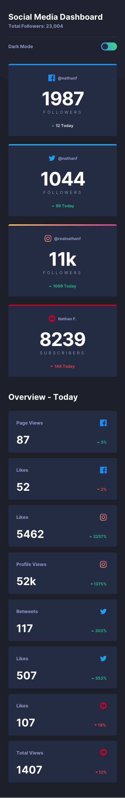

# social-media-dashboard-with-theme-switcher

#

This is the [social-media-dashboard-with-theme-switcher]

## Table of contents

- [Overview](#overview)
  - [The challenge](#the-challenge)
  - [Screenshot](#screenshot)
  - [Links](#links)
  - [Built with](#built-with)
  - [What I learned](#what-i-learned)
  - [Continued development](#continued-development)

## Main Overview

The overview of the project is to build out the landing page of susnnyside creative site. The site is responsive for both mobile,tablet and a desktop version of the design.

### The challenge

Users should be able to:

- View the optimal layout for the site depending on their device's screen size
- See hover states for all interactive elements on the page
  The designs were created to the following widths:

- Mobile: 375px
  -Tablet: 768px
- Desktop: 1440px

### Screenshot





### Links

- Solution URL: [solution URL ](https://github.com/victoriaodemakin/social-media-dashboard-with-theme-switcher)
- Live Site URL: [live site URL ](https://victoriaodemakin.github.io/social-media-dashboard-with-theme-switcher/)

## My process

### Built with

- Semantic HTML5 markup
- CSS custom properties
- Flexbox
- CSS Grid
- Mobile-first workflow
- [Javascript](https://reactjs.org/) - JS library

### What I learned

Use this section to recap over some of your major learnings while working through this project. Writing these out and providing code samples of areas you want to highlight is a great way to reinforce your own knowledge.

To see how you can add code snippets, see below:

```html
<body>
    <section class="body-container">
    <section class="container">
      <div class="warpper">
        <h1>Social Media Dashboard</h1>
        <p>Total Followers: 23,004</p>
        <hr />
      </div>
      <div class="toggle-area">
        <p>Dark Mode</p>
        <input type="checkbox" name="theme"
         class="toggle-btn" id="checkbox" />
        <!--the class will be usd to style the checkbox while the id will be refernced with js-->
        <label for="checkbox" class="label">
          
          
        <div class="slider-ball"></div>
      </div>
        </label>
```

```css
.hero-bg {
  width: 100%;
  background-image: url(../images/mobile/image-header.jpg);
  background-position: center;
  background-repeat: no-repeat;
  background-size: cover;
  padding: 1em;
  padding-top: 1.5em;
  padding-bottom: 4em;
}

header {
  display: flex;
  justify-content: space-between;
  width: 100%;
}
```

```js
var mobilemenu = document.getElementById("mobilemenu");
var nav = document.getElementById("nav");
var mobilemexit = document.getElementById("mobileexit");

mobilemenu.addEventListener("click", function (e) {
  nav.classList.toggle("hide-mobile");
  e.preventDefault();
});

mobileexit.addEventListener("click", function (e) {
  nav.classList.add("hide-mobile");
  e.preventDefault();
});
```

### Continued development

All other future projects will be focused on using Vue.Js Framework.which is found useful that to refine and perfect future project
